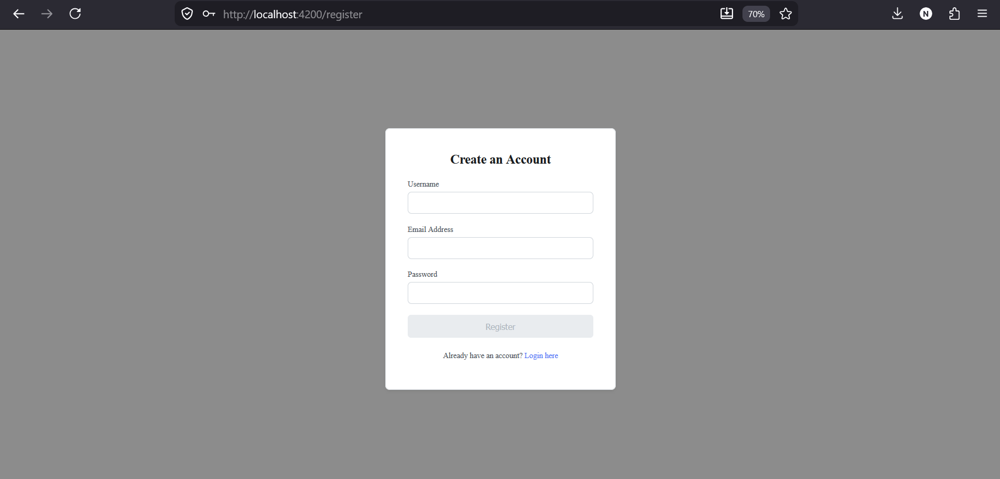
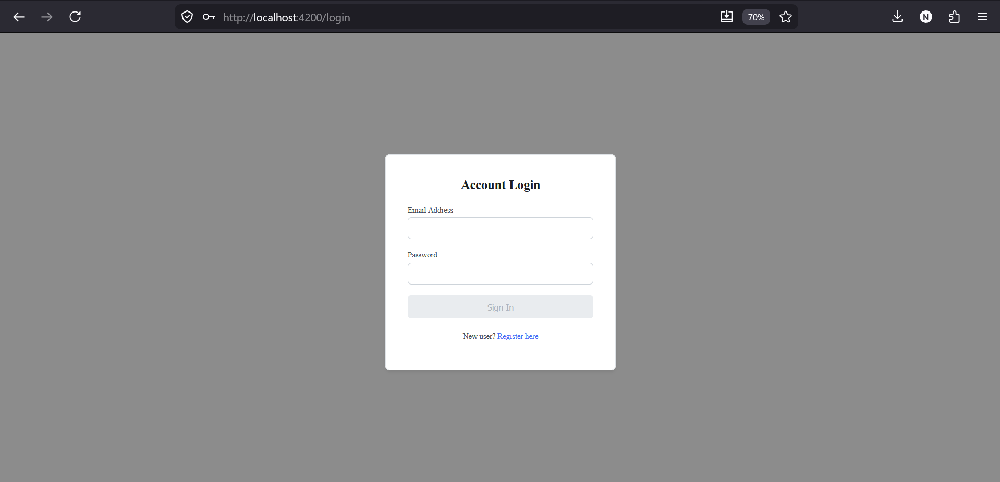
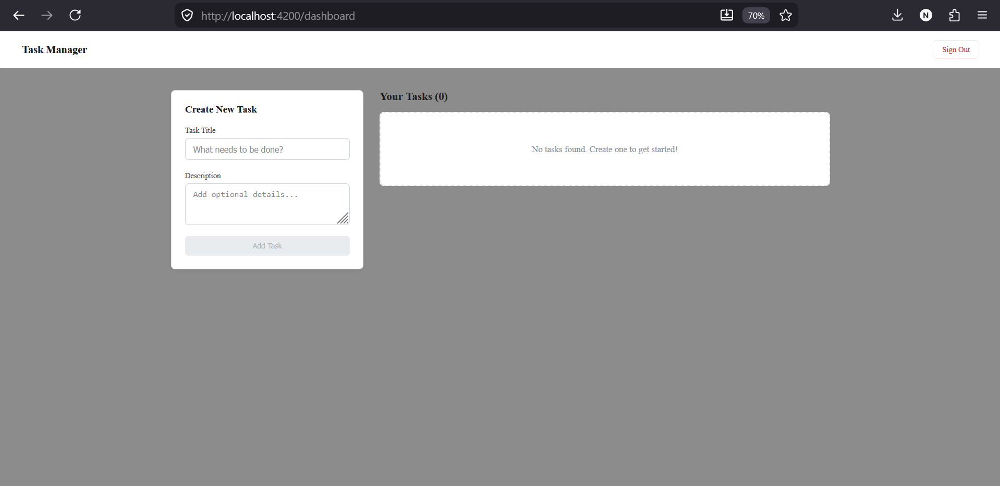

# Task Manager App – Binaried Assignment

A secure, full-stack Task Management application built with **Angular 17+**, **Node.js (Express)**, and **MongoDB** as part of the Binaried AI Full Stack Developer Intern assignment.

---

## 🚀 Live Demo

> Run locally using setup instructions below.

---

## ✨ Features

- **JWT Authentication** — Secure register/login with BCrypt password hashing
- **Protected Routes** — Auth Guard blocks dashboard access without valid token
- **HTTP Interceptor** — Automatically attaches Bearer token to every API request
- **Full CRUD** — Create, Read, Update (status), Delete tasks
- **User Isolation** — Each user sees only their own tasks (filtered by JWT userId)
- **sessionStorage** — Tab-isolated session management (prevents cross-tab contamination)
- **Responsive UI** — Clean, minimal design works on all screen sizes

---

## 🤖 AI Tools Used & How

| AI Tool | How I Used It |
|---|---|
| Claude (Anthropic) | Architecture design, debugging interceptor logic, sessionStorage migration |
| GitHub Copilot | Boilerplate generation for Express routes and Angular components |

### Where AI Helped
- Designed the JWT middleware flow (authMiddleware.js)
- Suggested sessionStorage over localStorage to prevent multi-tab session bugs
- Helped structure the Angular standalone component architecture
- Debugged the auth interceptor not attaching headers correctly

### What I Implemented Myself
- Full backend REST API (Express + MongoDB + Mongoose)
- Angular Auth Guard and HTTP Interceptor logic
- User-isolated task filtering (tasks belong to logged-in user only)
- BCrypt password hashing on register, comparison on login
- Complete CRUD operations with ownership verification on update/delete

---

## 🛠 Tech Stack

### Backend
| Technology | Usage |
|---|---|
| Node.js + Express | REST API server |
| MongoDB + Mongoose | Database + ODM |
| JWT (jsonwebtoken) | Stateless authentication |
| BCrypt (bcryptjs) | Password hashing |

### Frontend
| Technology | Usage |
|---|---|
| Angular 17+ | Standalone component SPA |
| TypeScript | Strongly typed language |
| HTTP Interceptor | Auto-attaches JWT Bearer token |
| Auth Guard | Protects dashboard route |
| sessionStorage | Tab-isolated session management |

---

## 📂 Project Structure

```text
task-manager-app/
├── backend/
│   ├── middleware/
│   │   └── authMiddleware.js     → JWT token validation
│   ├── models/
│   │   ├── User.js               → User schema
│   │   └── Task.js               → Task schema
│   ├── routes/
│   │   ├── auth.js               → Register + Login
│   │   └── tasks.js              → Full CRUD (protected)
│   └── index.js                  → Express app + MongoDB
└── frontend/
    └── src/app/
        ├── components/           → login, register, dashboard
        ├── guards/               → auth-guard, interceptors
        ├── services/             → api.ts
        └── app.routes.ts
```
---

## ⚙️ Setup Instructions

### Prerequisites
- Node.js v18+
- MongoDB (local) or MongoDB Atlas (free cloud)
- Angular CLI (`npm install -g @angular/cli`)

### 1. Clone the repository
```bash
git clone https://github.com/Nishanth4063/task-manager-app.git
cd task-manager-app
```

### 2. Backend Setup
```bash
cd backend
npm install
```
Create a `.env` file inside `backend/`:
```
PORT=5000
MONGO_URI=mongodb://127.0.0.1:27017/task_manager_db
JWT_SECRET=your_super_secure_jwt_secret_key
```
Start the backend:
```bash
npm run dev
```
Backend runs at: `http://localhost:5000`

### 3. Frontend Setup
```bash
cd ../frontend
npm install
ng serve
```
Frontend runs at: `http://localhost:4200`

---

## 🔗 API Endpoints

### Auth
| Method | Endpoint | Description |
|---|---|---|
| POST | `/api/auth/register` | Register new user (BCrypt hashed) |
| POST | `/api/auth/login` | Login + get JWT token |

### Tasks (All Protected — JWT required)
| Method | Endpoint | Description |
|---|---|---|
| GET | `/api/tasks` | Get all tasks for logged-in user |
| POST | `/api/tasks` | Create new task |
| PUT | `/api/tasks/:id` | Update task (ownership verified) |
| DELETE | `/api/tasks/:id` | Delete task (ownership verified) |

---

## 🖥️ Application Screenshots

### Register Page


### Login Page


### Dashboard


---

## ⚡ Challenges & How I Solved Them

**Challenge 1 — Cross-tab session contamination:**
Initially used `localStorage` which shares state across all browser tabs. A user logged in on Tab 1 would affect Tab 2. Fixed by migrating to `sessionStorage` which is tab-isolated and clears automatically when the tab closes.

**Challenge 2 — JWT not attaching to requests:**
The auth interceptor wasn't correctly reading the token on first load. Fixed by ensuring `sessionStorage.setItem('token')` in login component runs before navigation, so the interceptor always finds the token on subsequent requests.

---

## 🔮 Future Improvements

- **Real-time updates** — Socket.io for live task sync across devices
- **Task categories & priority levels** — Filter and sort by priority
- **Due dates & reminders** — Email notifications for upcoming tasks
- **Unit tests** — Jest for backend routes, Jasmine/Karma for Angular components
- **Docker deployment** — Containerize with Docker Compose for production

---

## 👨‍💻 Author

**Nishanth K** — Full-Stack Developer
[GitHub](https://github.com/Nishanth4063) | [Email](mailto:nishanth.sks2003@gmail.com)